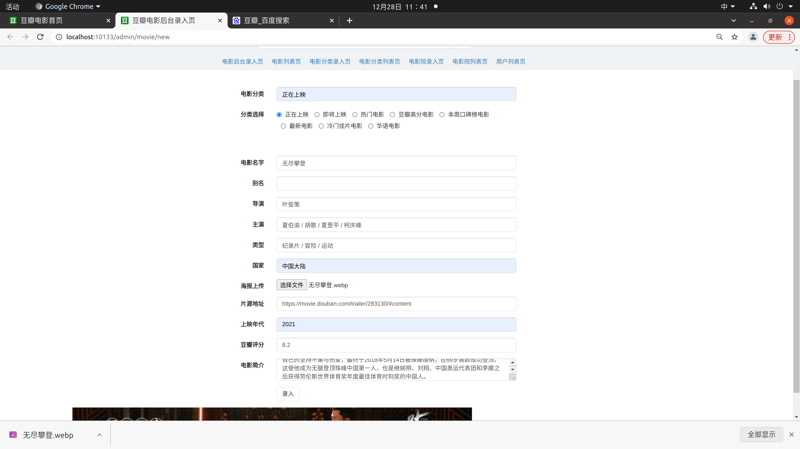
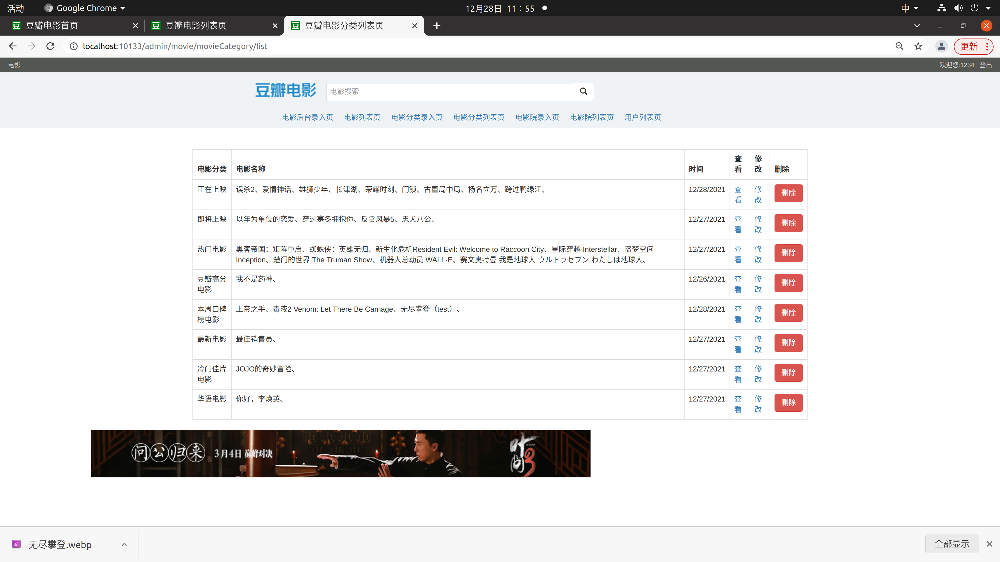

# 项目说明书

## 1）项目设计部分：

### （1）项目总体构成

#### 结构上：

##### 1.前端：

前端JS脚本、css样式、ajax前后端交互请求、图片延迟加载、jade页面

##### 2.后端：

jada模板引擎、mongodb数据库增删改查、express与nodejs路由设置、静态文件

#### 功能上：

##### 1.普通用户：

1）账户的注册与登陆

2）电影的搜索

3）电影分类页浏览

4）电影院搜索

5）海报宣传页的浏览

6）电影资讯的浏览

7）具体电影详情页的浏览

8）对具体电影的评论与回复

9）电影预告片的浏览

##### 2.管理员： 账号为1234 密码为1234

1）电影的后台录入（即电影详情页信息的录入）

2）全部电影的增删改查

3）电影分类的增减

4）电影分类页面的增删改查

5）电影院的增删改查

6）用户列表的查看和删除

7）访客统计

### （2）引入的包在项目中的作用相关说明；

express：后台框架的搭建、路由的设置

mongodb：数据库的存储

fs：文件管理

Ajax：前后端数据的交互

bcryptjs：对密码进行加密

jade：前端渲染

mocha：单元测试框架

mongoose：对mongodb的操作

### （3）项目目录结构和各个部分的说明

```
├── app.js            项目入口文件
├── app               Node后端MVC文件目录
│   ├── controllers   控制器目录
│   │   ├── movie     电影页面控制器目录
│   │   └── user      用户列表控制器目录
│   ├── models        模型目录
│   │   ├── movie	  电影模型
│   │   └── user	  用户模型
│   ├── schemas       模式目录
│   │   ├── movie	  电影模式
│   │   └── user	  用户模式
│   └── views         视图文件目录
│       ├── includes  页面整体结构渲染
│       └── pages	  页面具体内容渲染
├── DataBase 		  存放数据库文件
│   └── 190110910133
├── node_modules      node模块目录
├── public            静态文件目录
│   ├── images        图片目录
│   │   ├── includes  公共图片目录
│   │   ├── movie	  电影页面相关图片
│   │   └── user	  用户相关图片
│   ├── libs          经过gulp处理后文件所在目录
│   │   ├── css		  css脚本
│   │   ├── images	  电影页面相关图片
│   │   └── scripts	  页面交互脚本
│   ├── sass          样式目录
│   │   ├── include	  页面细节样式
│   │   ├── movie	  电影相关页面细节样式
│   ├── scripts       JS脚本目录
│   │   └── js		  
│   └── upload        海报生成存储目录
│       ├── movie	  电影海报存储
├── route             路由目录
│   └── router.js
├── test              测试文件目录
│   └── images		  录入电影时海报上传文件
│   └── user
│       └── user.js	  用户测试脚本
├── README.md		  开发日记
├── gulpfile.js       gulp文件
├── package.json
└── doc 			  存放项目说明书
```

## 2）数据库设计：

categories 电影分类表：

| 字段名 | 注释               | 是否主键 |
| ------ | ------------------ | -------- |
| _id    | id                 | 是       |
| meta   | 创建时间、修改时间 |          |
| movies | 电影列表           |          |
| name   | 名字               |          |

cities 城市列表：

| 字段名         | 注释               | 是否主键 |
| -------------- | ------------------ | -------- |
| _id            | id                 | 是       |
| name           | 城市名             |          |
| meta           | 创建时间、修改时间 |          |
| cityCategories | 城市所属分类id     |          |

citycategories 城市分类表：

| 字段名        | 注释               | 是否主键 |
| ------------- | ------------------ | -------- |
| _id           | id                 | 是       |
| cityProgramme | 城市字段id         |          |
| name          | 分类名             |          |
| meta          | 创建时间、修改时间 |          |
| cities        | 城市id             |          |

cityprogrammes 城市字段表：

| 字段名         | 注释               | 是否主键 |
| -------------- | ------------------ | -------- |
| _id            | id                 | 是       |
| cityCategories | 城市所属分类id     |          |
| name           | 分类名             |          |
| meta           | 创建时间、修改时间 |          |

moviescomments 电影评论表：

| 字段名  | 注释               | 是否主键 |
| ------- | ------------------ | -------- |
| _id     | id                 | 是       |
| movie   | 电影id             |          |
| from    | 评论人id           |          |
| content | 回复内容           |          |
| meta    | 创建时间、修改时间 |          |
| reply   | 回复人id           |          |

movie 电影表：

| 字段名   | 注释               | 是否主键 |
| -------- | ------------------ | -------- |
| _id      | id                 | 是       |
| pv       | 访客量             |          |
| doctor   | 导演姓名           |          |
| category | 所属分类id         |          |
| title    | 电影名             |          |
| meta     | 创建时间、修改时间 |          |
| casts    | 主演姓名           |          |
| genres   | 电影类型           |          |
| aka      | 别名               |          |
| country  | 国家               |          |
| poster   | 海报文件名         |          |
| flash    | 预告片连接         |          |
| year     | 年                 |          |
| rating   | 评分               |          |
| summary  | 简介               |          |

user 用户表：

| 字段名   | 注释                                    | 是否主键 |
| -------- | --------------------------------------- | -------- |
| _id      | id                                      | 是       |
| name     | 账号                                    |          |
| password | 密码                                    |          |
| role     | 权限 （50以上为管理员）50以下为普通用户 |          |
| meta     | 创建时间、修改时间                      |          |

## 3）使用说明书：

#### 普通用户：


首页页面浏览


点击右上角注册按钮 进行账户注册


输入账号0001 密码1234 验证码后，验证码正确，点击注册即可成功注册账户0001


注册账号后，立即登陆为注册账号


页面左上角显示当前正在上映电影，设置为每过5秒进行翻页


或者可以直接点击右上角的左右切换按钮进行上下两页的切换，到最后一页时再点击下一页，即将回到第一页


点击正在上映右边的即将上映按钮，切换为显示即将上映的电影，同样是5秒进行页面轮换，逻辑与正在上映相同。


下方选电影/电视剧 功能模块，为分类电影选择模块，可以在热门、豆瓣高分、本周口碑榜、最新、冷门佳片、华语6个分类区中选择


下方热门推荐模块，显示当前热门的咨询

点击右上角左右切换按钮就能进行推荐页的切换，也可自动切换，时间为5s


点击图片 或者 右方热门推荐的标题，就能进入具体情况页面浏览


右方搜索栏是城市电影院的搜索栏


在左方的城市下拉栏中选择想要查询的城市，比如杭州


就能在右方搜索栏中看到所有可售影院


下方是电影活动显示页，点击标题就能进入详情页浏览


右下方是本周口碑榜电影排名显示


点击上帝之手 即可进入具体电影详情页


首页的所有电影，通过点击海报图片，都能进入具体电影的详情页


点击误杀2电影海报，即可进入电影详情页，电影详情页的信息来自管理员实现录入的信息，包含电影名、又名、导演、主演、类型、国家/地区、上映年份、简介、豆瓣评分还有预告片。


点击右方观看预告片按钮，即可进入预告片播放页


详情页下方是评论区，用户可发送评论


未登陆用户，需要登陆账号才能进行评论


在评论输入框输入评论点击提交


提交之后，所发的评论就能在下方看到，评论区显示评论发送人、发送内容、还有发送时间。

可以对别人的评论进行回复


点击回复按钮在评论输入框中选择需要评论的内容，点击提交


即可对别的用户的评论进行回复

发送人可以对自己的评论进行删除操作


点击删除按钮即可删除自己所发的评论


首页搜索框可以搜索想要查询的电影


输入 蜘蛛侠 关键词点击搜索按钮


即可显示想要搜索的内容


搜索栏指出不完全搜索

点击搜索栏左边的 豆瓣电影，即可回到首页

#### 管理员：


管理员账号为 1234 密码为1234


点击登陆，进入管理员页面

管理员页面下方出现电影后台录入页、电影列表页、电影分类录入页、电影院录入页、电影院列表页、用户列表页


电影后台录入页为电影信息录入



录入无尽攀登电影信息


点击录入即可跳转到电影详情页


首页正在上映电影增添了刚刚录入的电影


电影列表页可以查询数据库中所有的电影，并对其进行查看、修改和删除的操作

查看即为进入电影详情页，修改为修改电影详情页内容


修改刚刚录入的无尽攀登电影的分类，选择为本周口碑榜电影、电影名改为无尽攀登（test）

点击录入


即可修改内容电影名已修改


首页本周口碑榜电影即增加刚刚修改的电影


而正在上映页面则变回原样


电影分类录入页可增加电影分类


电影分类列表页可查看各分类区的电影详情，并进行查看修改和删除操作


在分类录入页面输入港片点击录入


即可增加分类区


点击查看正在上映电影的查看按钮即可查看所有该分区的电影




点击港片分类区的删除按钮，即可删除该分类区。而修改按钮即进入电影列表页对具体电影的分类进行修改以实现分类区内电影的修改。


点击电影院录入页，增加电影院。


输入新建分类 AA  点击录入 下方分类归类增加AA


选择 AA 输入城市分类 aaa 点击录入 下方显示增加分类aaa  

 

选择AA 分类选择 aaa 城市输入 百官 点击录入

 影院名称横店影视城 点击录入


用户列表页显示所有用户列表，可删除用户

点击删除0001


用户0001消失


重新登陆0001显示用户不存在


点击无尽攀登 删除按钮


无尽攀登电影消失


在首页也消失，删除操作是对数据库内容的删除

## 4）github信息：

远程仓库：https://github.com/yadadaa/Finalassignment/tree/master

账号：yedadaa

在此特别鸣谢来自Loogeek用户提供的代码


